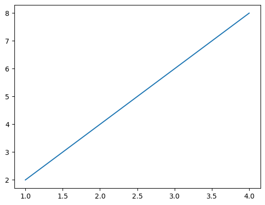

# Example Blocks

<div class="font-mono example-block__label">Output:</div>
<div class="example-block__wrapper">
<div class="font-mono example-block__content">shape: (3, 7)
┌──────┬──────┬──────┬──────┬──────┬──────┬──────┬──────┬──────┬──────┬──────┬──────┬──────┬──────┬──────┬──────┬───────┬──────┬──────┬──────┐
│ col1 ┆ col2 ┆ col3 ┆ col3 ┆ col3 ┆ col3 ┆ col3 ┆ col3 ┆ col3 ┆ col3 ┆ col3 ┆ col3 ┆ col3 ┆ col3 ┆ col3 ┆ col3 ┆ col4  ┆ col5 ┆ col6 ┆ col7 │
│ ---  ┆ ---  ┆ ---  ┆ ---  ┆ ---  ┆ ---  ┆ ---  ┆ ---  ┆ ---  ┆ ---  ┆ ---  ┆ ---  ┆ ---  ┆ ---  ┆ ---  ┆ ---  ┆ ---   ┆ ---  ┆ ---  ┆ ---  │
│ i64  ┆ str  ┆ f64  ┆ f64  ┆ f64  ┆ f64  ┆ f64  ┆ f64  ┆ f64  ┆ f64  ┆ f64  ┆ f64  ┆ f64  ┆ f64  ┆ f64  ┆ f64  ┆ bool  ┆ i64  ┆ str  ┆ f64  │
╞══════╪══════╪══════╪══════╪══════╪══════╪══════╪══════╪══════╪══════╪══════╪══════╪══════╪══════╪══════╪══════╪═══════╪══════╪══════╪══════╡
│ 1    ┆ a    ┆ 10.5 ┆ 10.5 ┆ 10.5 ┆ 10.5 ┆ 10.5 ┆ 10.5 ┆ 10.5 ┆ 10.5 ┆ 10.5 ┆ 10.5 ┆ 10.5 ┆ 10.5 ┆ 10.5 ┆ 10.5 ┆ true  ┆ 100  ┆ x    ┆ 0.1  │
│ 1    ┆ a    ┆ 10.5 ┆ 10.5 ┆ 10.5 ┆ 10.5 ┆ 10.5 ┆ 10.5 ┆ 10.5 ┆ 10.5 ┆ 10.5 ┆ 10.5 ┆ 10.5 ┆ 10.5 ┆ 10.5 ┆ 10.5 ┆ true  ┆ 100  ┆ x    ┆ 0.1  │
│ 1    ┆ a    ┆ 10.5 ┆ 10.5 ┆ 10.5 ┆ 10.5 ┆ 10.5 ┆ 10.5 ┆ 10.5 ┆ 10.5 ┆ 10.5 ┆ 10.5 ┆ 10.5 ┆ 10.5 ┆ 10.5 ┆ 10.5 ┆ true  ┆ 100  ┆ x    ┆ 0.1  │
│ 1    ┆ a    ┆ 10.5 ┆ 10.5 ┆ 10.5 ┆ 10.5 ┆ 10.5 ┆ 10.5 ┆ 10.5 ┆ 10.5 ┆ 10.5 ┆ 10.5 ┆ 10.5 ┆ 10.5 ┆ 10.5 ┆ 10.5 ┆ true  ┆ 100  ┆ x    ┆ 0.1  │
│ 1    ┆ a    ┆ 10.5 ┆ 10.5 ┆ 10.5 ┆ 10.5 ┆ 10.5 ┆ 10.5 ┆ 10.5 ┆ 10.5 ┆ 10.5 ┆ 10.5 ┆ 10.5 ┆ 10.5 ┆ 10.5 ┆ 10.5 ┆ true  ┆ 100  ┆ x    ┆ 0.1  │
│ 1    ┆ a    ┆ 10.5 ┆ 10.5 ┆ 10.5 ┆ 10.5 ┆ 10.5 ┆ 10.5 ┆ 10.5 ┆ 10.5 ┆ 10.5 ┆ 10.5 ┆ 10.5 ┆ 10.5 ┆ 10.5 ┆ 10.5 ┆ true  ┆ 100  ┆ x    ┆ 0.1  │
│ 1    ┆ a    ┆ 10.5 ┆ 10.5 ┆ 10.5 ┆ 10.5 ┆ 10.5 ┆ 10.5 ┆ 10.5 ┆ 10.5 ┆ 10.5 ┆ 10.5 ┆ 10.5 ┆ 10.5 ┆ 10.5 ┆ 10.5 ┆ true  ┆ 100  ┆ x    ┆ 0.1  │
│ 2    ┆ b    ┆ 20.1 ┆ 20.1 ┆ 20.1 ┆ 20.1 ┆ 20.1 ┆ 20.1 ┆ 20.1 ┆ 20.1 ┆ 20.1 ┆ 20.1 ┆ 20.1 ┆ 20.1 ┆ 20.1 ┆ 20.1 ┆ false ┆ 200  ┆ y    ┆ 0.2  │
│ 1    ┆ a    ┆ 10.5 ┆ 10.5 ┆ 10.5 ┆ 10.5 ┆ 10.5 ┆ 10.5 ┆ 10.5 ┆ 10.5 ┆ 10.5 ┆ 10.5 ┆ 10.5 ┆ 10.5 ┆ 10.5 ┆ 10.5 ┆ true  ┆ 100  ┆ x    ┆ 0.1  │
│ 1    ┆ a    ┆ 10.5 ┆ 10.5 ┆ 10.5 ┆ 10.5 ┆ 10.5 ┆ 10.5 ┆ 10.5 ┆ 10.5 ┆ 10.5 ┆ 10.5 ┆ 10.5 ┆ 10.5 ┆ 10.5 ┆ 10.5 ┆ true  ┆ 100  ┆ x    ┆ 0.1  │
│ 1    ┆ a    ┆ 10.5 ┆ 10.5 ┆ 10.5 ┆ 10.5 ┆ 10.5 ┆ 10.5 ┆ 10.5 ┆ 10.5 ┆ 10.5 ┆ 10.5 ┆ 10.5 ┆ 10.5 ┆ 10.5 ┆ 10.5 ┆ true  ┆ 100  ┆ x    ┆ 0.1  │
│ 2    ┆ b    ┆ 20.1 ┆ 20.1 ┆ 20.1 ┆ 20.1 ┆ 20.1 ┆ 20.1 ┆ 20.1 ┆ 20.1 ┆ 20.1 ┆ 20.1 ┆ 20.1 ┆ 20.1 ┆ 20.1 ┆ 20.1 ┆ false ┆ 200  ┆ y    ┆ 0.2  │
│ 2    ┆ b    ┆ 20.1 ┆ 20.1 ┆ 20.1 ┆ 20.1 ┆ 20.1 ┆ 20.1 ┆ 20.1 ┆ 20.1 ┆ 20.1 ┆ 20.1 ┆ 20.1 ┆ 20.1 ┆ 20.1 ┆ 20.1 ┆ false ┆ 200  ┆ y    ┆ 0.2  │
│ 2    ┆ b    ┆ 20.1 ┆ 20.1 ┆ 20.1 ┆ 20.1 ┆ 20.1 ┆ 20.1 ┆ 20.1 ┆ 20.1 ┆ 20.1 ┆ 20.1 ┆ 20.1 ┆ 20.1 ┆ 20.1 ┆ 20.1 ┆ false ┆ 200  ┆ y    ┆ 0.2  │
│ 2    ┆ b    ┆ 20.1 ┆ 20.1 ┆ 20.1 ┆ 20.1 ┆ 20.1 ┆ 20.1 ┆ 20.1 ┆ 20.1 ┆ 20.1 ┆ 20.1 ┆ 20.1 ┆ 20.1 ┆ 20.1 ┆ 20.1 ┆ false ┆ 200  ┆ y    ┆ 0.2  │
│ 2    ┆ b    ┆ 20.1 ┆ 20.1 ┆ 20.1 ┆ 20.1 ┆ 20.1 ┆ 20.1 ┆ 20.1 ┆ 20.1 ┆ 20.1 ┆ 20.1 ┆ 20.1 ┆ 20.1 ┆ 20.1 ┆ 20.1 ┆ false ┆ 200  ┆ y    ┆ 0.2  │
│ 2    ┆ b    ┆ 20.1 ┆ 20.1 ┆ 20.1 ┆ 20.1 ┆ 20.1 ┆ 20.1 ┆ 20.1 ┆ 20.1 ┆ 20.1 ┆ 20.1 ┆ 20.1 ┆ 20.1 ┆ 20.1 ┆ 20.1 ┆ false ┆ 200  ┆ y    ┆ 0.2  │
│ 2    ┆ b    ┆ 20.1 ┆ 20.1 ┆ 20.1 ┆ 20.1 ┆ 20.1 ┆ 20.1 ┆ 20.1 ┆ 20.1 ┆ 20.1 ┆ 20.1 ┆ 20.1 ┆ 20.1 ┆ 20.1 ┆ 20.1 ┆ false ┆ 200  ┆ y    ┆ 0.2  │
│ 1    ┆ a    ┆ 10.5 ┆ 10.5 ┆ 10.5 ┆ 10.5 ┆ 10.5 ┆ 10.5 ┆ 10.5 ┆ 10.5 ┆ 10.5 ┆ 10.5 ┆ 10.5 ┆ 10.5 ┆ 10.5 ┆ 10.5 ┆ true  ┆ 100  ┆ x    ┆ 0.1  │
│ 1    ┆ a    ┆ 10.5 ┆ 10.5 ┆ 10.5 ┆ 10.5 ┆ 10.5 ┆ 10.5 ┆ 10.5 ┆ 10.5 ┆ 10.5 ┆ 10.5 ┆ 10.5 ┆ 10.5 ┆ 10.5 ┆ 10.5 ┆ true  ┆ 100  ┆ x    ┆ 0.1  │
│ 1    ┆ a    ┆ 10.5 ┆ 10.5 ┆ 10.5 ┆ 10.5 ┆ 10.5 ┆ 10.5 ┆ 10.5 ┆ 10.5 ┆ 10.5 ┆ 10.5 ┆ 10.5 ┆ 10.5 ┆ 10.5 ┆ 10.5 ┆ true  ┆ 100  ┆ x    ┆ 0.1  │
│ 1    ┆ a    ┆ 10.5 ┆ 10.5 ┆ 10.5 ┆ 10.5 ┆ 10.5 ┆ 10.5 ┆ 10.5 ┆ 10.5 ┆ 10.5 ┆ 10.5 ┆ 10.5 ┆ 10.5 ┆ 10.5 ┆ 10.5 ┆ true  ┆ 100  ┆ x    ┆ 0.1  │
│ 2    ┆ b    ┆ 20.1 ┆ 20.1 ┆ 20.1 ┆ 20.1 ┆ 20.1 ┆ 20.1 ┆ 20.1 ┆ 20.1 ┆ 20.1 ┆ 20.1 ┆ 20.1 ┆ 20.1 ┆ 20.1 ┆ 20.1 ┆ false ┆ 200  ┆ y    ┆ 0.2  │
│ 2    ┆ b    ┆ 20.1 ┆ 20.1 ┆ 20.1 ┆ 20.1 ┆ 20.1 ┆ 20.1 ┆ 20.1 ┆ 20.1 ┆ 20.1 ┆ 20.1 ┆ 20.1 ┆ 20.1 ┆ 20.1 ┆ 20.1 ┆ false ┆ 200  ┆ y    ┆ 0.2  │
│ 2    ┆ b    ┆ 20.1 ┆ 20.1 ┆ 20.1 ┆ 20.1 ┆ 20.1 ┆ 20.1 ┆ 20.1 ┆ 20.1 ┆ 20.1 ┆ 20.1 ┆ 20.1 ┆ 20.1 ┆ 20.1 ┆ 20.1 ┆ false ┆ 200  ┆ y    ┆ 0.2  │
│ 2    ┆ b    ┆ 20.1 ┆ 20.1 ┆ 20.1 ┆ 20.1 ┆ 20.1 ┆ 20.1 ┆ 20.1 ┆ 20.1 ┆ 20.1 ┆ 20.1 ┆ 20.1 ┆ 20.1 ┆ 20.1 ┆ 20.1 ┆ false ┆ 200  ┆ y    ┆ 0.2  │
│ 2    ┆ b    ┆ 20.1 ┆ 20.1 ┆ 20.1 ┆ 20.1 ┆ 20.1 ┆ 20.1 ┆ 20.1 ┆ 20.1 ┆ 20.1 ┆ 20.1 ┆ 20.1 ┆ 20.1 ┆ 20.1 ┆ 20.1 ┆ false ┆ 200  ┆ y    ┆ 0.2  │
│ 2    ┆ b    ┆ 20.1 ┆ 20.1 ┆ 20.1 ┆ 20.1 ┆ 20.1 ┆ 20.1 ┆ 20.1 ┆ 20.1 ┆ 20.1 ┆ 20.1 ┆ 20.1 ┆ 20.1 ┆ 20.1 ┆ 20.1 ┆ false ┆ 200  ┆ y    ┆ 0.2  │
│ 3    ┆ c    ┆ 30.2 ┆ 30.2 ┆ 30.2 ┆ 30.2 ┆ 30.2 ┆ 30.2 ┆ 30.2 ┆ 30.2 ┆ 30.2 ┆ 30.2 ┆ 30.2 ┆ 30.2 ┆ 30.2 ┆ 30.2 ┆ true  ┆ 300  ┆ z    ┆ 0.3  │
└──────┴──────┴──────┴──────┴──────┴──────┴──────┴──────┴──────┴──────┴──────┴──────┴──────┴──────┴──────┴──────┴───────┴──────┴──────┴──────┘
</div></div>

smaller scrollbar

<div class="font-mono example-block__label">Output:</div>
<div class="example-block__wrapper">
<div class="font-mono example-block__content">┌──────┬──────┬──────┬───────┬──────┬──────┬──────┐
│ col1 ┆ col2 ┆ col3 ┆ col4  ┆ col5 ┆ col6 ┆ col7 │
│ ---  ┆ ---  ┆ ---  ┆ ---   ┆ ---  ┆ ---  ┆ ---  │
│ i64  ┆ str  ┆ f64  ┆ bool  ┆ i64  ┆ str  ┆ f64  │
╞══════╪══════╪══════╪═══════╪══════╪══════╪══════╡
│ 1    ┆ a    ┆ 10.5 ┆ true  ┆ 100  ┆ x    ┆ 0.1  │
│ 2    ┆ b    ┆ 20.1 ┆ false ┆ 200  ┆ y    ┆ 0.2  │
│ 3    ┆ c    ┆ 30.2 ┆ true  ┆ 300  ┆ z    ┆ 0.3  │
└──────┴──────┴──────┴───────┴──────┴──────┴──────┘
</div></div>

Empty blocks are not going to be exported

# Sql Blocks

```sql
print("hello world")
-- %%sql --save not_nulls --no-execute
-- %%sql --save not_nulls --no-execute

SELECT *
FROM penguins.csv
WHERE bill_length_mm IS NOT NULL
AND bill_depth_mm IS NOT NULL

%sqlplot boxplot --column bill_length_mm bill_depth_mm --table not_nulls
```

# Code Blocks with mdparams and Attributes <span class="tag" tag-name="folded"><span class="smallcaps">folded</span></span>

The next block has complex `:mdparams` and other attributes. The filter
should:

- Put `js` as the language
- Inline all attributes into the fence header
- Leave attribute order and values intact

```javascript showLineNumbers=false collapse={1-5, 12-14, 21-24} /\/ho.*\// "given text" {"1":5} del={"2":7-8} ins={"3":10-12}
function demo() {
  // Mark any given text inside lines
  return 'Multiple matches of the given text are supported';
}
echo "Test" > /home/test.txt
// All this boilerplate setup code will be collapsed
import { someBoilerplateEngine } from '@example/some-boilerplate'
import { evenMoreBoilerplate } from '@example/even-more-boilerplate'

```

Here is some simple JavaScript code with `:del` and `:ins` attributes:

```javascript org-language=js del={"2":7-8} ins={"3":10-12}
console.log('This code is syntax highlighted!')

```

Here is a separator to visually break sections in the output:

------------------------------------------------------------------------

Code block attributes are transferred as-is from Org header args:

```javascript org-language=js frame=none
console.log('Title attribute example')

```

This line mimics a “title” attribute in the rendered Markdown:

`js title`"my-test-file.js"

Shell code block without any special attributes:

```bash org-language=sh
echo "This terminal frame has no title"

```

Diff block that should be highlighted as JavaScript due to `:lang js`:

```diff lang=js
  function thisIsJavaScript() {
    // This entire block gets highlighted as JavaScript,
    // and we can still add diff markers to it!
-   console.log('Old code to be removed')
+   console.log('New and shiny code!')
  }

```

A block that uses `:mdparams "given text"` to mark text inside lines:

```javascript "given text" org-language=js
function demo() {
  // Mark any given text inside lines
  return 'Multiple matches of the given text are supported';
}

```

# Jupyter / Session-Based Code and Example Output <span class="tag" tag-name="ATTACH"><span class="smallcaps">ATTACH</span></span>

Jupyter-like block with a Python session and simple text output:

```python session=py kernel=devenv exports=both
print("hi there")

```

<div class="font-mono example-block__label">Output:</div>
<div class="example-block__wrapper">
<div class="font-mono example-block__content">hi there
</div></div>

More complex Jupyter block that produces a table-like textual result and
an image:

```python session=py kernel=devenv exports=both results=file file=output.png
import matplotlib.pyplot as plt
import polars as pl

df = pl.DataFrame({
    "col1": [1, 2, 3],
    "col2": ["a", "b", "c"],
    "col3": [10.5, 20.1, 30.2],
    "col4": [True, False, True],
    "col5": [100, 200, 300],
    "col6": ["x", "y", "z"],
    "col7": [0.1, 0.2, 0.3],
})

print(df)

```

<div class="font-mono example-block__label">Output:</div>
<div class="example-block__wrapper">
<div class="font-mono example-block__content">shape: (3, 7)
┌──────┬──────┬──────┬───────┬──────┬──────┬──────┐
│ col1 ┆ col2 ┆ col3 ┆ col4  ┆ col5 ┆ col6 ┆ col7 │
│ ---  ┆ ---  ┆ ---  ┆ ---   ┆ ---  ┆ ---  ┆ ---  │
│ i64  ┆ str  ┆ f64  ┆ bool  ┆ i64  ┆ str  ┆ f64  │
╞══════╪══════╪══════╪═══════╪══════╪══════╪══════╡
│ 1    ┆ a    ┆ 10.5 ┆ true  ┆ 100  ┆ x    ┆ 0.1  │
│ 2    ┆ b    ┆ 20.1 ┆ false ┆ 200  ┆ y    ┆ 0.2  │
│ 3    ┆ c    ┆ 30.2 ┆ true  ┆ 300  ┆ z    ┆ 0.3  │
└──────┴──────┴──────┴───────┴──────┴──────┴──────┘
</div></div>

See [go to section two](#section-two)

```python session=py kernel=devenv exports=both
import matplotlib.pyplot as plt
x = [1, 2, 3, 4]
y = [2, 4, 6, 8]
plt.plot(x, y)
plt.savefig('output.svg')

# import polars as pl

# df = pl.DataFrame({
#     "col1": [1, 2, 3],
#     "col2": ["a", "b", "c"],
#     "col3": [10.5, 20.1, 30.2],
#     "col4": [True, False, True],
#     "col5": [100, 200, 300],
#     "col6": ["x", "y", "z"],
#     "col7": [0.1, 0.2, 0.3],
# })

# print(df)

```



<div class="font-mono example-block__label">Output:</div>
<div class="example-block__wrapper">
<div class="font-mono example-block__content">shape: (3, 7)
┌──────┬──────┬──────┬───────┬──────┬──────┬──────┐
│ col1 ┆ col2 ┆ col3 ┆ col4  ┆ col5 ┆ col6 ┆ col7 │
│ ---  ┆ ---  ┆ ---  ┆ ---   ┆ ---  ┆ ---  ┆ ---  │
│ i64  ┆ str  ┆ f64  ┆ bool  ┆ i64  ┆ str  ┆ f64  │
╞══════╪══════╪══════╪═══════╪══════╪══════╪══════╡
│ 1    ┆ a    ┆ 10.5 ┆ true  ┆ 100  ┆ x    ┆ 0.1  │
│ 2    ┆ b    ┆ 20.1 ┆ false ┆ 200  ┆ y    ┆ 0.2  │
│ 3    ┆ c    ┆ 30.2 ┆ true  ┆ 300  ┆ z    ┆ 0.3  │
└──────┴──────┴──────┴───────┴──────┴──────┴──────┘
</div></div>

```python results=output noweb=yes noweb-prefix=no exports=both

import duckdb
duckdb.sql("""SELECT *,
  CASE WHEN n % 2 = 0 THEN 'Even' ELSE 'Odd' END AS parity
FROM (SELECT * FROM generate_series(1, 10000000) AS t(n))
WHERE n % 99999 = 0 LIMIT 4;""").show()

```

<div class="font-mono example-block__label">Output:</div>
<div class="example-block__wrapper">
<div class="font-mono example-block__content">┌────────┬─────────┐
│   n    │ parity  │
│ int64  │ varchar │
├────────┼─────────┤
│  99999 │ Odd     │
│ 199998 │ Even    │
│ 299997 │ Odd     │
│ 399996 │ Even    │
└────────┴─────────┘
</div></div>
